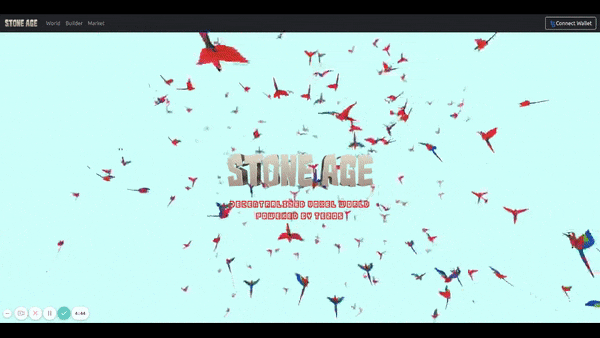
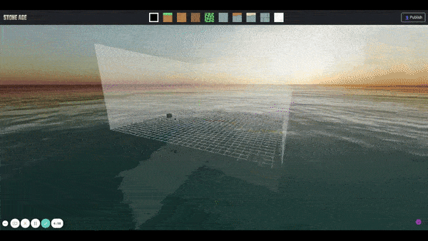
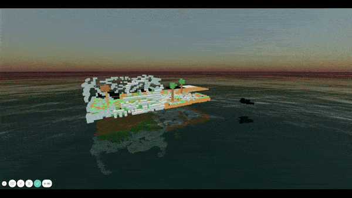
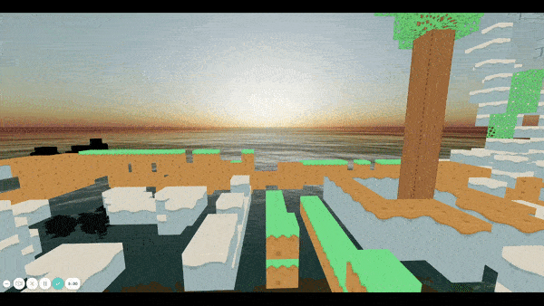

# StoneAge

Voxel World created, shared and owned by its users which resembles the StoneAge time. World is divided into 11 continents and each continent is further divided into 11x11 CubeLand. Each CubeLand has 64x64x32 units in size.

## Preview

### [HomePage](https://stoneage.vercel.app)

HomePage with logo, descriptiom and dynamic birds flying in the background which can be distured bringing the mouse pointer closer to them and can change the orbit view by dragging mouse.

### [Builder](https://stoneage.vercel.app/builder)

Builder provides a set of tiles from which the owner can select and build over the land. Tiles can be of any color or some pre defined textures like stone, sand, tree leaves which match according to the stoneage period. After building the owner can connect the wallet and publish it over the land piece they wish.

### [World](https://stoneage.vercel.app/world)

The land pulished over using the builder will be displayed in the world according to the land cordinates. Each land is 64x64x32 in size. And each cube is 2x2x2 in size. The world is built over the ocean and it also provies a beautiful view of sunset.

The world provides many controls

-   [_Orbit_](https://stoneage.vercel.app/world?controls=orbit)  
    View the world from the God's eye. Right or left click and drag to roatate around. And using the middle mouse button can zoom in and out.

    

-   [_Move_](https://stoneage.vercel.app/world?controls=move)  
     Walk or run using the keyboard controls as Arrow keys or "WASD" for forward, left, backward, right and "QE" for moving down and moving top. Can also use "Shift" to increase the speed.

     

-   [_Fly_](https://stoneage.vercel.app/world?controls=fly)  
     Be the Harry Potter of the world and fly using the FlyControls. You just need to give it direction using the pointer and use the left click for forward and left click for moving backward. And use shift to increase the speed.

    https://user-images.githubusercontent.com/51911161/146641635-510a6caa-5bdc-402e-a764-a1f1bba982cf.mp4

### [MarketPlace](https://stoneage.vercel.app/marketplace)

Buy and sell cubeland for XTZ using the marketplace. The user can also view all the cubelands owned by them in the marketplace "My Cubes" section.

### [Mint](https://stoneage.vercel.app/mint)

Here you can mint the cubeland.
