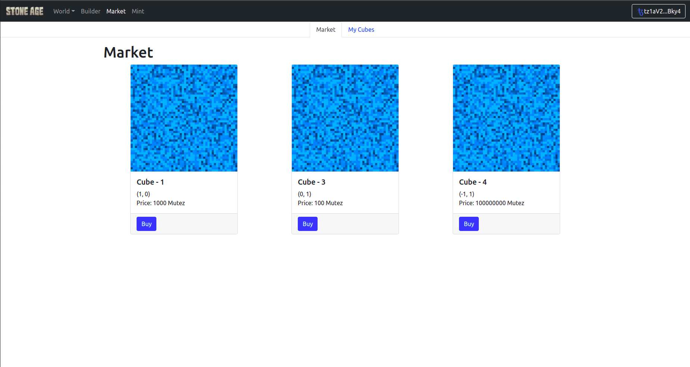
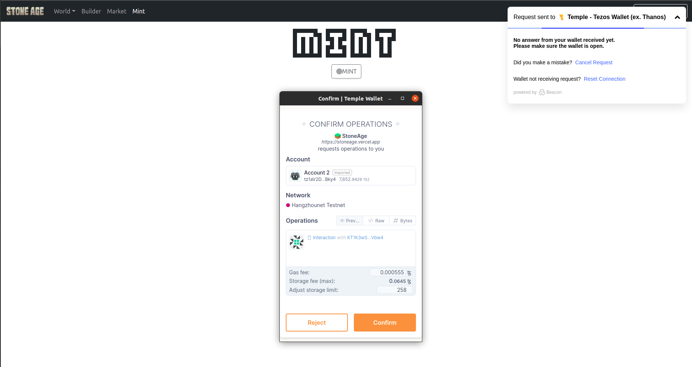

# StoneAge

[stoneage.vercel.app](http://stoneage.vercel.app/)

## What is StoneAge

StoneAge: A decentralized world shared, created and owned by its users. It is named so, as only cubes can be used to build the world. So this is the metaverse's stone age, which will keep evolving with time and advancements.

StoneAge world is divided into 11 continents, and each continent is further divided into 121 land pieces. Each land piece will be an NFT. And the owner of the land can build over it using the different colours and tiles of cube available.

$CUBE is the world currency token. And each land will be passively generating 1$CUBE token each day, which can be transferred, bought, sold or used to increase the land value as discussed below.

Currently, there are ten different cube types available for each land. And the owner is provided with 100 cubes of each type initially with the land. If the owner wishes to increase the number of cubes, they can burn 1 $CUBE token to add one cube piece to its land. The more the number of cubes attatched to land, the more valuable the land is.

## Preview

### [HomePage](https://stoneage.vercel.app)

HomePage with logo, descriptiom and dynamic birds flying in the background which can be distured bringing the mouse pointer closer to them and can change the orbit view by dragging mouse.

### [Builder](https://stoneage.vercel.app/builder)

Builder provides a set of tiles from which the owner can select and build over the land. Tiles can be of any color or some pre defined textures like stone, sand, tree leaves which match according to the stoneage period. After building the owner can connect the wallet and publish it over the land piece they wish.

### [World](https://stoneage.vercel.app/world)

The land pulished over using the builder will be displayed in the world according to the land cordinates. Each land is 64x64x32 in size. And each cube is 2x2x2 in size. The world is built over the ocean and it also provies a beautiful view of sunset.

The world provides many controls

-   [_Orbit_](https://stoneage.vercel.app/world?controls=orbit)  
    View the world from the God's eye. Right or left click and drag to roatate around. And using the middle mouse button can zoom in and out.

    

-   [_Move_](https://stoneage.vercel.app/world?controls=move)  
     Walk or run using the keyboard controls as Arrow keys or "WASD" for forward, left, backward, right and "QE" for moving down and moving top. Can also use "Shift" to increase the speed.

     

-   [_Fly_](https://stoneage.vercel.app/world?controls=fly)  
     Be the Harry Potter of the world and fly using the FlyControls. You just need to give it direction using the pointer and use the left click for forward and left click for moving backward. And use shift to increase the speed.

    https://user-images.githubusercontent.com/51911161/146641635-510a6caa-5bdc-402e-a764-a1f1bba982cf.mp4

### [MarketPlace](https://stoneage.vercel.app/marketplace)

Buy and sell cubeland for XTZ using the marketplace. The user can also view all the cubelands owned by them in the marketplace "My Cubes" section.

### [Mint](https://stoneage.vercel.app/mint)

Here you can mint the cubeland.

## Contracts

-   Cube Nft Registry: [KT1K3wSAb6M1BjgfX9Ze9w5fzSRNo1UXVbw4](https://better-call.dev/hangzhou2net/KT1K3wSAb6M1BjgfX9Ze9w5fzSRNo1UXVbw4/operations)
-   $Cube Collector: In Progress
-   $CUBE Token: FA2 fungible single asset token, completed but not deployed as $CUBE collector is needed.

## To Be Done

for the first version to complete

-   [ ] Completing the $CUBE collector token.
-   [ ] Deciding the tokenomics of $CUBE.
-   [ ] Continent Atlas

features planned

-   [ ] NFTs Gallery over land
